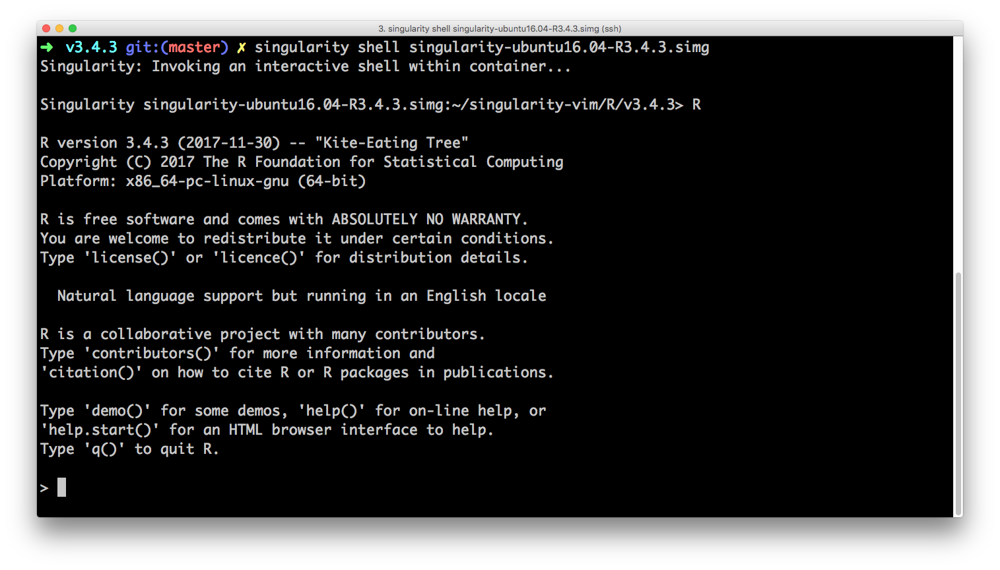

# singularity-ubuntu16.04-R3.4.3.simg



To create an image using the Singularity definition on this folder, run the commands

```
IMAGE=singularity-ubuntu16.04-R3.4.3.simg
DEFINITION=Singularity

singularity image.create -s 5000 $IMAGE
sudo singularity build $IMAGE $DEFINITION
```
